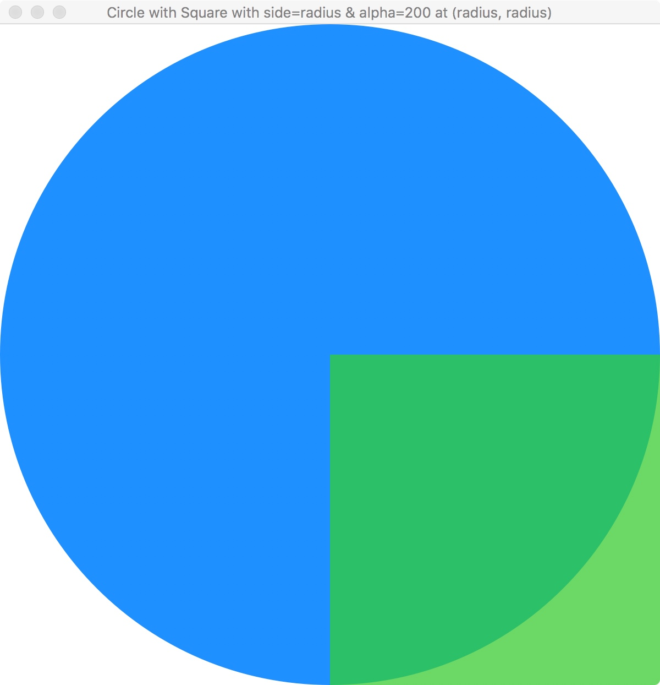

# CSCI 1100 Gateway to Computer Science

### Fall 2022

---

## An Animation Library for Python

---
```
COLOR
    def make(red, green, blue, alpha=255):
    def red(color):   return color.r
    def green(color): return color.g
    def blue(color):  return color.b
    def alpha(color): return color.a
    def random():
    
IMAGE
    def circle(radius, color, lineWidth=0):
    def line(points, color, lineWidth=0):
    def polygon(points, color, lineWidth=0):
    def rectangle(width, height, color, lineWidth=0):
    def empty(width, height, color):
    def text(string, color, size=FONTSIZE):
    
    def placeImage(top, xy, bottom):
    def placeImages(tops, xys, bottom):
    
  PNGs
    def read(path):
    def show(path):
    def dimensions(image):
    def toArray(image):
    def fromArray(a):

ANIMATE
    def start(model=None,
              width=defaultWidth,
              height=defaultHeight,
              view=defaultView,               # model -> Image
              tickUpdate=defaultTickUpdate,   # model -> model
              touchUpdate=defaultTouchUpdate, # model * x * y * UP/DOWN -> model
              keyUpdate=defaultKeyUpdate,     # model * keyname -> model
              stopWhen=defaultStopWhen,       # model -> boolean
              viewLast=defaultViewLast,       # model -> Image
    
```
---
### Getting Started

In CSCI 1100, we'll be using a non-standard library supporting simple graphics and animation. The library, called `Animate` is a simplified version of the [Universe](http://www.is.ocha.ac.jp/~asai/Universe/en/), library which was developed by Kenichi Asai and Chihiro Uehara. (And the Universe library was based on a similar library for the programming language Racket.)

This document gives a brief overview of the Animate library. The library contains 3 main parts: 1. `Animate`, 2. `Image` and 3. `Color`.

### The Graphics Display

The graphics system used in the library is based on a 2D plane with x-coordinates running from left to right and **y-coordinates running from top to bottom**. So (0, 0) are the coordinates of the point at the upper left and (width, height) is the point at the lower right. The simplest sort of graphic is the empty display with the default width and height of 800 pixels.

```python
Animate.start()
```


In the example, the `Animate.start` function is called with no arguments. But it has several optional arguments. Each optional argument has a name and a default value. For example, the optional `title` argument has the default value of the name of our class. The optional `width` and `height` arguments both have default values of 800. The default values can be overridden by the programmer. For example, to create a display with width 800, height 600 and title, "Wordle", we could write

```python
Animate.start(title="Wordle", width=800, height=600)
```

The order of named arguments doesn't matter. And note the convention: when using the `=` sign to provide values for named arguments, we usually don't include spaces on either side.

### Color

Colors are combinations of varying levels of *red*, *green* and *blue*. The levels vary between 0 and 255. In addition, a color has an *alpha* value that determines transparency. A color with alpha value of 255 is opaque, while a color with alpha value of 0 is completely transparent. 

The `Color` library contains several pre-defined colors and a function `Color.make` for making colors from RGB inputs. It also contains a function for making random colors and four functions for taking colors apart.

```python
Color.make : int * int * int * ?alpha=int -> color
# Given r, g and b values ranging between 0 and 255, the call Color.make(r, g, b) creates an opaque color. Given r, g, b and alpha values ranging between 0 and 255, the call Color.make(r, g, b, alpha=alpha) creates a non-opaque color.

Color.random : unit -> color
# Returns an opaque color with r, g and b chosen randomly.

Color.red   : color -> int
Color.green : color -> int
Color.blue  : color -> int
Color.alpha : color -> int
# The call Color.red(color) returns an integer representing the red component of color.
```

When all of red, green and blue are 0, the color is black. When they're all 255 the color is white. And more generally, any color with equal levels of red, green and blue provides a shade of gray.


```python
model=None,
title="CSCI 1100",
width=WIDTH,
height=HEIGHT,
view=defaultView,               # model -> Image
tickUpdate=defaultTickUpdate,   # model -> model
touchUpdate=defaultTouchUpdate, # model * x * y * UP/DOWN -> model
keyUpdate=defaultKeyUpdate,     # model * keyname -> model
stopWhen=defaultStopWhen,       # model -> boolean
viewLast=defaultViewLast,       # model -> Image
rate=FPS
```


### Images

The **Image** library has several functions for creating images that can be placed on the display. 

##### Image.circle(radius, color, lineWidth=0)

The `Image.circle` function accepts a `radius`, a `color` and an optional `lineWidth`. If the `lineWidth` is 0 the image is a filled circle. If the `lineWidth` is greater than 0, then the circle is an outline of the specified width.

```python
Image.circle(200, Color.DodgerBlue)
Image.circle(200, Color.DodgerBlue, lineWidth=10)
```

|  |  | 
| :--------------------------------------: | :--------------------------------------: |
|                  lineWidth=0                  | lineWidth=10 |

**The Bounding Box**

The smallest rectangle containing all of the points of an image is called the *bounding box* of the image. The upper left corner of the bounding box is the point with the minimum x value and minimum y value of the set of points in the image. This point is called the image's *pin*. In the image below, the bounding box and pin are shown in red.

|                |
| :----------------------------------------------------------: |
| Red line shows bounding box with pin at (min x, min y). Circle image is placed at (200, 200) on backing. |

#### Building Images Compositionally

The bounding box is a conceptual tool for thinking about building composite images. We can layer one image on top of the other using the function `Image.placeImage(upper, (x, y), lower)`. For example, the `Image.circle` function doesn't show its bounding box. But we can create a function to make a bounded circle as rendered above.

```python
def boundedCircle(radius, color):
  side   = radius * 2
  box    = Image.rectangle(side, side, Color.Red, lineWidth=1)
  circle = Image.circle(radius, color)
  return Image.placeImage(circle, (0, 0), box)
```

In the example, the `placeImage` function places `circle` on top of `box`. But where? Circle's pin (i.e., upper left) is placed at position `(0, 0)` of the lower image `box`. There is also a plural form of the `placeImage` function for placing multiple images compositionally in one call `placeImages(uppers, xys, lower)`.

##### Translucency

A color can be created using the `Color.make` function. A shape can be partially translucent by setting its color's *alpha* component to a value less than the default value of 255. For the image below right, we might use the following.

```python
def circleWithShadedSquare(radius):
  circle = Image.circle(radius, Color.DodgerBlue)
  green  = Color.make(0, 255, 0, alpha=200)
  square = Image.rectangle(radius, radius, green)
  return Image.placeImage(square, (radius, radius), circle)
```

|      |  |
| :-----------------------------------------------: | :-------------------------------------------: |
| Green square placed on Circle at (radius, radius) |          Green square with alpha=200          |


#### Lines

Lines are a little tricky at first. Lines are multi-segmented. Their segments are specified as a list of xy-*displacements* `Image.line([(dx1, dy1), ..., (dxN, dyN)], color, lineWidth)`. For example, consider a line with just one segment:

```python
def circleWithOneSegment(radius):
  circle = Image.circle(radius, Color.DodgerBlue)
  line   = Image.line([(radius, 0)], Color.Green, lineWidth=20)
  return Image.placeImage(line, (radius, radius), circle)
```

In the example, the first argument to the `Image.line` function is a list `[...`] containing a single pair `(radius, 0)`. The items in the list specify displacements for the end-points of segments in the line. The (dx, dy) pair `(radius, 0)` says, to find the end-point of this (the only) segment, travel `radius` pixels in the x direction and `0` pixels in the y direction. These displacements can be positive, zero or negative.

**Lines and their Bounding Boxes**

Like all images, lines have bounding boxes --- the smallest rectangle containing all of the points in the line. As usual, the pin of the bounding box is the minimum x and the minimum y, i.e., the upper left corner of the bounding box. Note that for a single-segment line, the pin-point is always one end of the line segment but **for multisegment lines, the pin-point may not be on the line**.

|  |         |  |
| :-------------------------------------------: | :--------------------------------------------------: | :-------------------------------------------: |
|              Line [(radius, 0)]               | Line [(radius, 0); (0, -radius)] at (radius, radius) |          Same line placed at (0, 0)           |

```python
# Code used for images center and right above.
def circleWithTwoSegments(radius, x, y):
  circle = Image.circle(radius, Color.DodgerBlue)
  line   = Image.line([(radius, 0), (0, -radius)], Color.Green, lineWidth=20)
  return Image.placeImage(line, (x, y), circle)

circleWithTwoSegments(300, 300, 300)      # Center
circleWithTwoSegments(300, 0, 0)          # Right
```

#### Polygons

A polygon is a shape with multiple sides. A triangle is a 3-sided polygon, a square is a 4-sided one and so forth. In the `Image` library, polygons are specified as multisegment lines `Image.polygon(dxys, color)`. 

For example, a *regular hexagon* is a hexagon where the 6 sides are of equal length and 6 equal angles. As with multi-segment lines, the pin-point of a polygon is the upper left corner of the polygon's bounding box and may not be a point on the polygon.


#### Text

Text can be displayed in *Veranda* font with varying size. The default size is 50. The pin-point for a text image is, as usual, upper left.
|  |  |
| :-----------------------------------------: | :-----------------------------------------: |
|            Default font size=50             |                Font size=200                |

```python
def draw(_):
  backing = Image.rectangle(800, 800, Color.Red)
  text = Image.text("Four score and seven years ...", Color.White, size=200)
  return Image.placeImage(text, (0, 0), backing)
```

Of course, it isn't too hard to make a labeled tile, or even a sequence of such tiles.

#### Bitmap Images

The animation library includes 5 functions for working with [Portable Network Graphic](https://en.wikipedia.org/wiki/Portable_Network_Graphics) images.

```python
Animate.show : filepath -> unit
Animate.read : filepath -> image
Animate.dimensions : image -> (int * int)
Animate.toArray : image -> 2D array
Animate.fromArray : 2D array -> image
```

The `Animate.show` function reads a PNG from a file and places it on the display. A program using `Animate.show` might receive the name of the file from the command line as in the following code.

```python
from animate import *

def go():
    if len(sys.argv) == 2:
        Animate.show(sys.argv[1])
    else:
        print("run: python3 pngShow.py pngfile")
        sys.exit()
go()
```
##### Working with PNG Files

After reading a PNG file with `Image.read`, the image can be converted into a 2-dimensional array of pixels (i.e., colors) using the `Image.toArray` function. The pixels in the array can then be processed one-by-one in a pair of nested loops.

```python
image = Image.read(filepath)
(width, height) = Image.dimensions(image)
pixels = Image.toArray(image)
for row in range(height):
  for col in range(width):
    ... processing of elements of pixels array ...
resultImage = Image.fromArray(pixels)
```

|  |  |
| :----------------------------------------: | :-----------------------------------------: |
|                                            |                                             |

### Animation and the Model-View-Update Approach

The `Animate` library allows one to code interactive graphical applications in Python using a variation of the [model-view-update](https://guide.elm-lang.org/architecture/) (MVU) software architecture (aka the [Elm software architecture](http://elm-lang.org/) ). MVU is a functional take on the [model-view-controller](https://en.wikipedia.org/wiki/Model%E2%80%93view%E2%80%93controller) architecture which was widely used in the heyday of object-oriented programming. 

The basic idea of is that the state of a graphical application is represented or "modeled" using a single value — in this architecture the value is called a *model*. For a non-trivial application the model will usually be a structured value with many parts. The MVU architecture is implemented in a cycle with the model being passed to a *view* function which produces a graphical representation, i.e., an image, of the model for the user to see. When *events* such as *clock-ticks*, *touchpad actions* or *keystrokes* occur, the model is threaded through an *update* function which produces a new model reflecting the changed state of the app.

```
                                      +------------+
                  +-------------------+    view    |<-------------------+
                  |                   +------------+                    |
                  v                                                     |
          +----------------+                                   +--------+-------+
          |     events     |                                   |      model     |
          +-------+--------+                                   +----------------+
                  |                                                     ^
                  |                   +------------+                    |
                  +------------------>|   update   +--------------------+
                                      +------------+
```

In the general MVU architecture, all of the different types of events are threaded through a single `update` function and the `update` function sorts out which kind of event occurred and how to transform the input model to the output model. For example, if the model represented a checking account with a balance field, and the event was a deposit, then the result of the update would be a model with an updated account balance.

##### Events and Event Handlers

In the Animate library, the `Animate.start` function handles only three types of events: **clock ticks**, **touchpad actions** and **key-strokes**, each with its own specialized update function, resp. `tickUpdate`, `touchUpdate` and `keyUpdate`. Clock ticks occur synchronously like a metronome. The touch and key events occur asynchronously when the user touches the touchpad or strikes a key.

Roughly speaking, the `Animate.start` function accepts several inputs and then loops as follows.

```python
def start(model, view, update, finished, viewLast):
  while not(finished(model)):
		image = view(model)
  	display(image)                   # Renders the image on the display
  	model = update(model)            # Animate actually has 3 different update functions
  
  finalImage = viewLast(model)
  display(finalImage)
```

Note that `view`, `update`, `finished` and `viewLast` are all functions accepting a model and returning some result. (The `update` function shown is a stand-in for 3 different update functions discussed below.)

Though the pseudo-code version of `start` shown above accepts only 5 inputs (i.e., `model`, `view`, `update`, `finished` and `viewLast`), the actual `Animate.start` functions accepts 11 inputs. Each input is optional -- all 11 have default values.

```python
model=None
title="Gateway to CS"
width=800
height=800
view=defaultView                # model -> Image                           
tickUpdate=defaultTickUpdate    # model -> model                           
touchUpdate=defaultTouchUpdate  # model * x * y * UP/DOWN -> model         
keyUpdate=defaultKeyUpdate      # model * keyname -> model                 
stopWhen=defaultStopWhen        # model -> boolean                         
viewLast=defaultViewLast        # model -> Image                           
rate=defaultFPS                 # default is 30 frames per second
```

So `Animate.start` can be called with no explicit arguments as in `Animate.start()` using the default values for all 11 of the parameters or `Animate.start` might be called with a few explicit arguments as in `Animate.start(model=12, height=600)` or `Animate.start` might be called with all 11 arguments explicitly provided, overriding all of the defaults.

**The Inputs to `Animate.Start`**

- The `model` input is the starter value of the model. This value is threaded through the `Animate.start` loop;

- The `title` input is a string specifying the title to appear atop the graphics display;

- The `width` and `height` inputs specify the dimensions of the display;

- The `view` input is a function of type `model -> image`. It is called each time through the loop with the `model` as input. It produces an image that the `start` function displays;

- The `rate` is the clock rate, the default is 30 frames per second;

- The `tickUpdate` input is a function of type `model -> model`. It is called for clock-tick events, each time through the loop;

- The `touchUpdate` input is a function of type  `model * x * y * event -> model`. It is called whenever a touch event occurs on the touchpad. The `touchUpdate` function accepts a model, the (x, y) coordinates of the touchpad event and a value specifying the kind of event --  either **`Touch.Up`** or **`Touch.Down`**. From these inputs the `touchUpdate` function produces a new model. 

  It's common to use touch events to change the *state* of the application. An application may start in a *State.Ready* state and transition to a *State.Running* state on a `Touch.Up` event. 

- The `keyUpdate` input is a function of type `model * keyname -> model`. This is called when a key is struck. The function accepts a model and a key name in the form of a string. It produces a new model. For a given key, the string name is a string representing the symbol on the key — "a" or "A". The arrow keys are named as one would expect: **"left"**, **"right"**, **"up"** and **"down"**;
  
- The `stopWhen` input is a function of type `model -> bool`. It is called each time through the loop with the model as input. It returns a boolean. If it returns `true` `Animate.start` will call the `viewLast : model -> image` function and terminate the loop.

- The `viewLast` input is function of type `model -> image`. It operates just like `view` but it is called only once, when the animation is ready to terminate.

