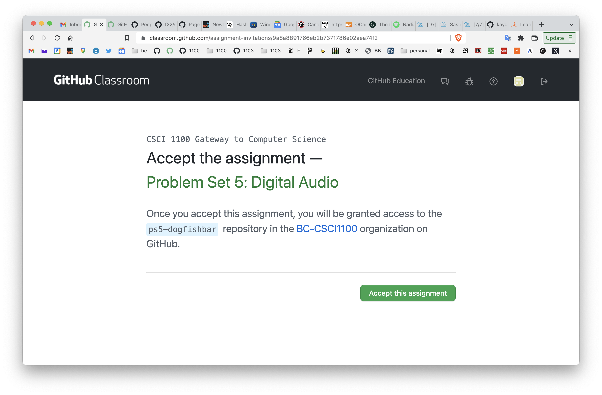
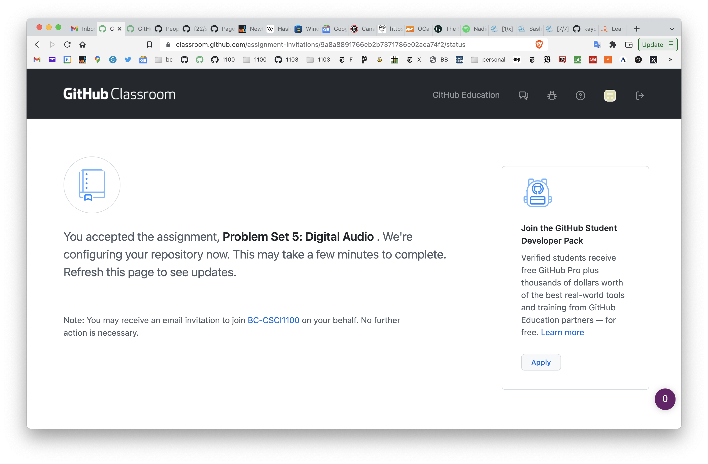
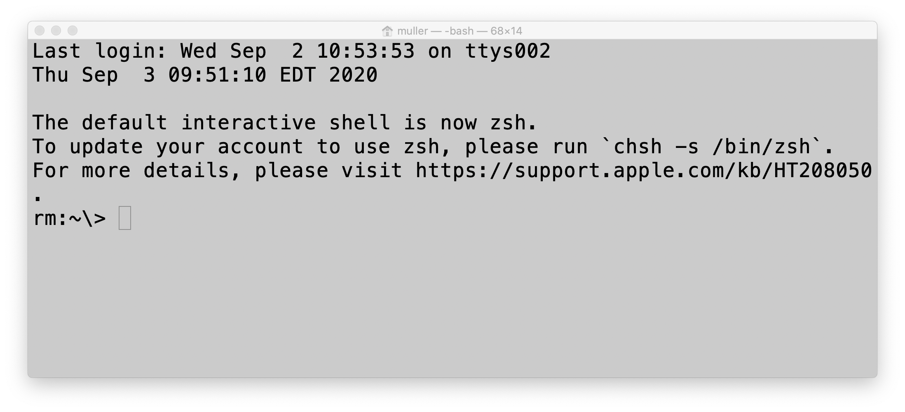
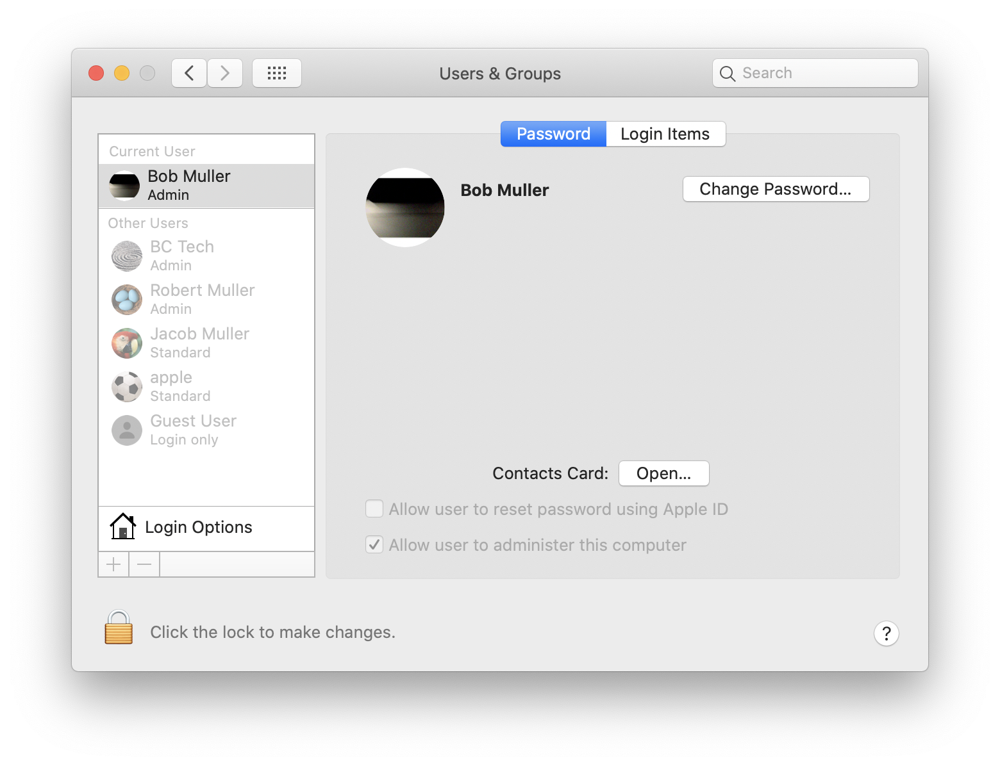
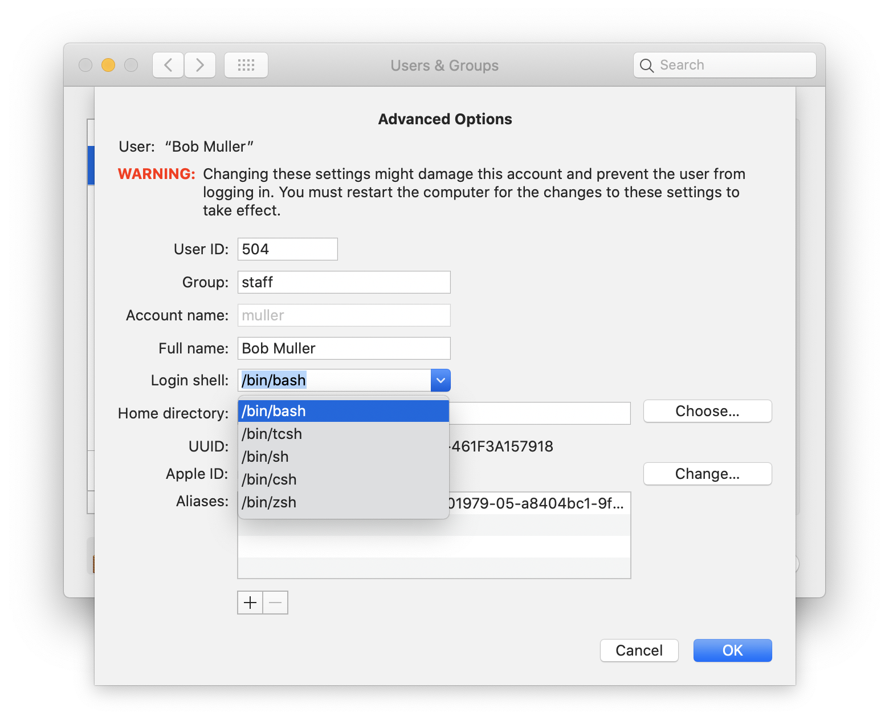
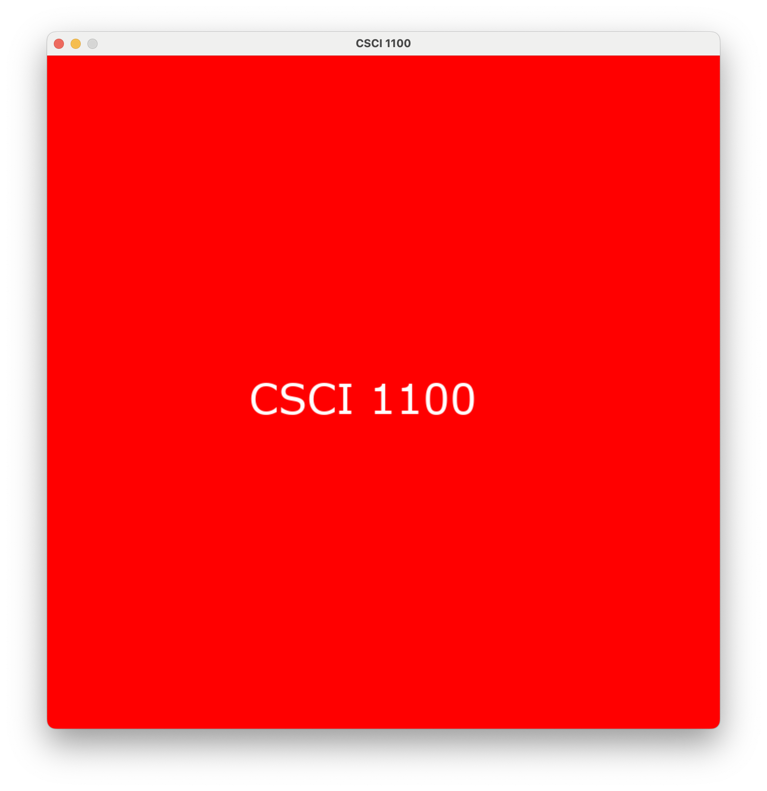
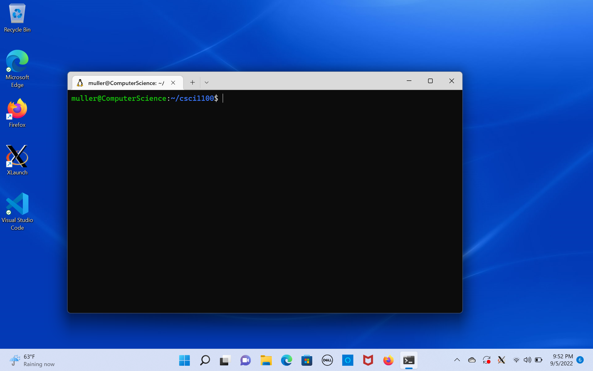

# CSCI 1100 Gateway to Computer Science

### Fall 2022

Robert Muller - Boston College

------

## Setting Up Your System

In this course, we'll be developing Python programs in a Unix environment on either MacOS or on a Windows system. If you have a much older version of one of these operating systems, you  may want to upgrade your system before proceeding further with problem set 1. 

The coding environment that we're going to install has a lot of parts and the installation process involves many steps that have to be carried out carefully and exactly as specified. Some of the installation steps take a long time so set aside plenty of time for this work. If you run into problems with the installation process, please get in touch with a course staffer. Most of the installation steps will involve using a *command shell* to issue commands to the Unix operating system. Command shells may be new for you, but the Unix command shell is quite powerful and widely used so learning to work with it will be a good skill to develop in its own right.

### Work Flow

The basic flow of work for the course will be as follows. From time to time, you'll receive an email from GitHub Classroom with an invitation to accept a problem set. The email will look something like this:



When you accept the invitation, GitHub Classroom will make a private copy of the problem set for you in a *repository* on GitHub and provide you with a URL link to that repo.



So now you have your own private repository containing your copy of the problem set, it's shared only with the course staff. Your repo is hosted along with all of the others on our course GitHub site `https://github.com/BC-CSCI1100/`. If you visit that site, you'll see just a few repos, the ones that are privately owned by you and those that are public.

We'll come back to the discussion of the course workflow after we've set up the software on your computer.

---

## Setup for MacOS

**If you're using a Windows system, skip this section -- scroll down to Setup for Windows.** The MacOS setup has 3 main parts:

1. Setting up your Work Area
2. Installing Python and some related software
3. Installing and Configuring the Visual Studio Code (vscode) Text Editor

---

### 1. Setting up your Work Area

1. We're going to be using the MacOS **Terminal** application as our Unix command shell. We'll be using it often so it would be wise to copy the icon for the Terminal application

   

   to your taskbar. The Terminal icon can be found using the Finder. Select *Applications* (on the left) then scroll down and select *Utilities*, then scroll down to find Terminal. Drag the icon to the taskbar. Now fire up the terminal by selecting the icon. The window generated by the app is a Unix command shell. The command shell prompts the user for input. It will look something like 

   the `rm:~\>` part at the bottom is the bash prompt. In the bash commands that follow, we'll omit the prompt to simplify cutting and pasting.

   <details><summary>Type <tt>echo $SHELL</tt> then hit the <tt>return</tt> key. If you see <tt>/bin/bash</tt>, press on. If you don't see <tt>/bin/bash</tt> open this detail.</summary>

   Your Terminal app is probably configured to run the **zsh** shell instead of  the **bash** shell.  You'll need to make an adjustment to cause it to run bash instead. Open *System Preferences* under the apple (upper left), select *Users & Groups*. 

   Unlock the lock (lower left, requires password) then control-click on your entry and select *Advanced Options*. Use the dropdown menu to select */bin/bash*. Select *Ok* then re-lock the *Users & Groups* panel.

   </details>

2. Most operating systems use a tree-structured hierarchy of *directories* (aka *folders*) for organizing resources. Directories and files can be addressed using *file paths*, sequences of directory names separated by the `/` character. For example, the path `/usr/local/bin/` addresses one of the directories that Unix uses for executable programs (aka, *binaries*).

   If you want to see what's in a given directory you can use the *list* command `ls path`. For example, the command

   ```bash
   ls /usr/local/
   ```

   shows

   ```bash
   Frameworks/  bin/    include/  n/              share/
   Library/     etc/    lib/      opt/            texlive/
   algs4/       go/     libexec/  remotedesktop/  var/
   ```

   Each user is assigned a *home directory* where they can organize their files and subdirectories. My home directory is located via the path`/Users/muller`. When a user is interacting with the operating system via a command shell, In addition to a home directory, the user will also have a *working directory*. The working directory will often change as commands are issued in the shell. We can see the current working directory using the *print working directory* command `pwd`:
   ```bash
   pwd
   ```
   In a fresh shell, this will show something like `/Users/muller` confirming that the working directory is initially set to the home directory. The *change directory* command `cd`,  when typed with just these two letters, will reset your working directory to the home directory.

   The *make directory* command `mkdir` makes a new directory in the current working directory. Let's make a work area for the materials developed in this class. We'll informally refer to this new directory as the *course home directory*.

   ```bash
   cd
   mkdir csci1100
   ```

   Done in this way, you can always navigate to our course home directory by typing

   ```bash
   cd
   cd csci1100
   ```

   Or equivalently in one line:

   ```bash
   cd ~/csci1100
   ```

   The tilde character `~` designates your home directory. 
   
   > **Pro tip:** If you don't like to type, you can start with the first few letters of a name then hit the tab key, bash will finish the name for you if it can.
   
   **Configuring git**
   
   We'll be using the `git` system. It likes to know a bit about you. Fire up a terminal and type
   
   ```bash
   git config --global user.email "YOUR EMAIL ADDRESS"
   git config --global user.name "YOUR NAME"
   ```
   
   where "YOUR EMAIL ADDRESS" and "YOUR NAME" are obviously yours. 
   
   Use `git clone` to install the course software library:
   
       cd ~/csci1100
       git clone https://github.com/BC-CSCI1100/lib.git

The `git clone` command will likely cause GitHub to ask you for your GitHub username and password. Heads up! It doesn't really want your password, it wants you *personal access token* that you made in PS0. If you have it, paste it into the password field. If you don't have it, no problem, make a new one and paste that one into the password field.

If the above steps don't work, see the instructor.

To finish up this part, stash the location of the course animation library away in the `PYTHONPATH` environment variable.

```bash
echo "export PYTHONPATH=\":$HOME/csci1100/lib/\"" >> ~/.bash_profile
source ~/.bash_profile
```

X-out the present terminal window and fire up a new one.

### 2. Installing Python and some related software

Visit [the Python site](https://www.python.org/downloads/) and download and install Python version 3.10. If you fire up a terminal, you should be able to start by typing either

```bash
python3
```

or simply

```bash
python
```

Go ahead and exit Python by typing `ctrl-d`, (i.e., hold down the control key, lower left, and type the letter d). We're going to use a local Python library that is based on two non-local Python libraries: `numpy` and `pygame`. In order to install them, type

``` bash
python3 -m ensurepip --upgrade
python3 -m pip install -U pygame --user
python3 -m pip install -U numpy --user
```

**Test Your Python Installation**

Before installing the editor, lets check to see if Python and our library are working correctly. Type

```bash
python ~/csci1100/lib/test/scroll.py
```

You should see something like this

 

If the above steps don't work, see the instructor.

### 3. Installing and Configuring the Visual Studio Code (vscode) Editor

1. Install [the vscode editor](https://code.visualstudio.com/).

2. Reboot your laptop.

3. Fire up the vscode editor. This can be done either through the GUI by clicking on the vscode icon

   

   or better yet, by using the unix command shell. Let's assume I've followed the advice and placed my course home directory `csci1100` in myhome directory and that I've cloned problem set 1 inside `csci1100`. 

   > That is, after accepting problem set 1 as described above, I fired up a terminal shell and typed
   >
   > ```bash
   > git clone https://github.com/BC-CSCI1100/ps1-dogfishbar.git
   > ```

   Then I would navigate to the coding area of my repo by typing:

   ```bash
   cd ~/csci1100/ps1-dogfishbar/src/
   code .
   ```

   Of course, for you, instead of  `dogfishbar` you would use your GitHub ID. This should open your problem set harness code in vscode. If this doesn't work, get in touch with course staff. Now select the *Explorer* icon at far upper left. You'll see a folder `src` which contains the harness code. Open that and you'll see two Python source files `helloWorld.py` and `fahrenheit.py`. 

   When you first open a Python file, vscode will recognize Python and will ask you if you'd like to install a Python extension to help with editing. Install this extension. 

   If you don't see this behavior, contact a course staffer. If you do, great! You're alll done! Scroll down to **Finishing up the Workflow** below.

---

## Setup for Windows

We're going to run a linux/unix operating system within Windows using version 2 of Windows Subsystem for Linux (WSL2). WSL2 works on Windows 11 systems and on Windows 10 systems that aren't too old. If you run into trouble early in these instructions, you might have an older version of Windows 10, see me. There are many different variations of Linux, we'll be using one of the most popular [Ubuntu](https://ubuntu.com/). (No need to register.)

Our steps are these:

1. Enable Windows Subsystem for Linux (WSL2) and Install Ubuntu
3. Set up our Working Area and Install CSCI1100 Library
4. Install the Visual Studio Code Editor

Let's get started.

---

### 1. Enable Windows Subsystem for Linux (WSL2) and Install Ubuntu

Before we get too far into these instructions, it will be useful to install the [Windows Terminal](https://docs.microsoft.com/en-us/windows/terminal/install) app, it's very handy. Once WSL2 is enabled and Ubuntu is up and running, you'll be able to have one Windows Terminal tab hosting Windows Powershell while another tab hosts a WSL/Ubuntu bash shell.

Unix development in Windows is made possible by the Windows Subsystem for Linux (WSL). If you have Windows 11 or a recent version of Windows 10, WSL is easy to install. If you don’t have that recent of a version, try running Windows Update to get it.

>  **Tip**
>
> If you get an error about the “virtual machine” while installing WSL, you might need to enable virtualization in your machine’s BIOS. The instructions for that are dependent on the manufacturer of your machine. Try googling “enable virtualization [manufacturer] [model]”, substituting for the manufacturer and model of your machine. This Red Hat Linux page might also help.

With a recent version of Windows, and assuming you’ve never installed WSL before, here’s all you have to do:

1. Open Windows PowerShell as Administrator. To do that, click Start, type PowerShell, and it should come up as the best match. Click “Run as Administrator”, and click Yes to allow changes.
2. Run `wsl --install`. (Or, if you've already installed WSL but not Ubuntu before, then instead run `wsl --install -d Ubuntu`.) When the Ubuntu download is completed, it will likely ask you to reboot. Do so. The installation will automatically resume after the reboot.
3. You'll be prompted to create a Unix username and password. You can use any username and password you wish. It has no bearing on your Windows username and password (though you are free to re-use those). Do not put a space in your username. **Don't forget your password.** You'll need it later.

**Warning**

Don't proceed with these instructions if you were not prompted to create a Unix username and password. Something has gone wrong. Perhaps your Ubuntu installation did not complete correctly. Try uninstalling Ubuntu and reinstalling it through the Windows Start menu.

**Ubuntu setup**. These rest of these instructions assume that you installed Ubuntu (20.04) as the Linux distribution. That is the default distribution in WSL. In principle other distributions should work, but might require different commands from this point forward.

Open the Ubuntu app. (It might already be open if you just finished installing WSL.) You will be at the Bash prompt, which looks something like this:



**Warning**

If that prompt instead looks like root@...#, something is wrong. Did you create a Unix username and password for Ubuntu in the earlier step above? If so, the username in this prompt should be the username you chose back then, not root. Do not proceed with these instructions if your prompt looks like root@...#. Perhaps you could uninstall Ubuntu and reinstall it.

**Check your Internet Connection**

Can Ubuntu see the internet? Find out by typing:

```bash
ping google.com
```

If you don't see packet transmission information, Ubuntu can't see what Windows presumably sees, this is probably due to a Windows Defender Firewall set up on your Windows Systems. See the instructor.

**Enable copy-and-paste:**

1. Click on the Ubuntu icon on the top left of the window.
2. Click Properties
3. Make sure “Use Ctrl+Shift+C/V as Copy/Paste” is checked.

Now Ctrl+Shift+C will copy and Ctrl+Shift+V will paste into the terminal. Note that you have to include Shift as part of that keystroke.

Run the following command to update the APT package manager, which is what helps to install Unix packages:

```bash
sudo apt update && sudo apt upgrade -y
```

You will be prompted for the Unix password you chose. The `sudo` runs the `apt` command as the administrator, aka “super user”. In other words, do this command from a privileged mode. **Running commands with `sudo` is potentially dangerous and should not be done lightly.** Do not get into the habit of putting `sudo` in front of commands, and do not randomly try it without reason.

Then install some useful packages that we'll need:

```bash
sudo apt install -y zip tree python3-pip
```

**File Systems**

WSL has its own filesystem that is distinct from the Windows file system, though there are ways to access each from the other.

When you launch Ubuntu and get the $ prompt, you are in the WSL file system. Your home directory there is named ~, which is a built-in alias for the path /home/your_ubuntu_user_name. You can run explorer.exe . (note the dot at the end of that) to open your Ubuntu home directory in Windows explorer.

From Ubuntu, you can access your Windows home directory at the path `/mnt/c/Users/your_windows_user_name/`.

From Windows Explorer, you can access your Ubuntu home directory under the Linux icon in the left-hand list (near “This PC” and “Network”), then navigating to Ubuntu → home → your_ubuntu_user_name. Or you can go there directly by typing into the Windows Explorer path bar: 

```
\\wsl$\Ubuntu\home\your_ubuntu_user_name
```

Practice accessing your Ubuntu and Windows home directories now, and make sure you can recognize which you are in. For advanced information, see [Microsoft’s guide to Windows and Linux file systems](https://docs.microsoft.com/en-us/windows/wsl/filesystems).

We recommend storing your Python work in your Ubuntu home directory rather than your Windows home directory. By implication, Microsoft also recommends that in the guide linked above.

At this point, you can run a bare-bones Ubuntu Unix terminal as an application within your WSL system. It's worth noting that as of this writing, WSL doesn't install any support for graphics of any kind including the graphical user interfaces (GUIs) that you're accustomed to.

1. Install Python

In Windows, navigate to python.org/downloads and install Python. Check the box related to the PATH and answer installation questions affirmatively. You can try it out from the Start icon.

### 3. Set up your Work Area

WSL has its own file system that is distinct from the Windows file system. You can edit Windows files from WSL, but you cannot edit WSL files from Windows. For more information about the differences between the Windows and WSL filesystems, and how to work with them, see [this guide](https://github.com/michaeltreat/Windows-Subsystem-For-Linux-Setup-Guide/blob/master/readmes/03_understanding_the_file_systems.md).

Most operating systems use a tree-structured hierarchy of *directories* (aka *folders*) for organizing resources. Each user is assigned a *home directory* where they can organize their files and subdirectories. When a user is interacting with the operating system via a command shell, in addition to a home directory, the user will also have a *current working directory*. The home directory is fixed but it's common for the current working directory to change as we interact with the shell. In the Ubuntu shell, type the *print working directory* command `pwd`

```bash
pwd
```

This will display a string called a *file path* which specifies the sequence of directories leading to the current working directory. For me, it shows the file path  `/home/muller`. This indicates that my Unix home directory is `muller` and the path to that home directory is `/home/muller/`.

> Pro tip: The tilde character `~` can be used as an abbreviation of the path to your home directory.

My Windows home directory is elsewhere, back to that in a minute.

One can make a subdirectory of the current working directory using the *make directory* command `mkdir`. Let's make a directory to hold the materials in this course, type

```bash
cd ~
mkdir csci1100
```

We'll call this the *course home directory*. One can see what files and directories are contained within a directory using the *list* command `ls`. Typing

```bash
ls
```

will show that the directory `/home/muller` now contains one item, the subdirectory `csci1100`. The current working directory can be changed via the *change directory* command `cd`. Typing

```bash
cd csci1100
```

> Pro tip: Instead of typing out all of the letters in `csci1100`, you can just type the first letter `c` and then hit the `tab` key and the command shell will finish it for you if it can. A great time saver.

Now use the `pwd` command to confirm that the current working directory is `/home/muller/csci1100`. To be clear, the *home directory* is still `/home/muller`. If we want to "return" to our home directory, all 4 of these options will do it:

```bash
1. cd /home/muller
2. cd ~        # remember that ~ is an abbreviation for the file path /home/muller
3. cd
4. cd ..       # set the current working dir to the parent directory, i.e., move up a level
```

Note that you can always move to the home directory for this course by typing `cd ~/csci1100`.

You can access your Windows home directory from WSL Linux via the path `/mnt/c/Users/YOUR_WINDOWS_NAME/` where `YOUR_WINDOWS_NAME` is your Windows username. It's convenient to make a link for it, so you could access it quickly, for instance, calling it `windows`. This is how to create such a link:

 ```bash
cd
ln -s /mnt/c/Users/YOUR_WINDOWS_NAME/ windows    # NOTE THE SPACE!
 ```

Now you can navigate to your Windows home directory from your Ubuntu command shell by typing `cd ~/windows` and to your course home directory by typing `cd ~/csci1100`.

**Introduce Yourself to git**

Git and GitHub like to know a little bit about you.

```bash
git config --global user.email "YOUR-EMAIL-ADDRESS"
git config --global user.name "YOUR-NAME"
```

where "YOUR-EMAIL-ADDRESS" and "YOUR-NAME" are obviously yours. 

Now use the `git clone` command to install the course animation library

```bash
cd ~/csci1100
git clone https://github.com/BC-CSCI1100/lib.git
```

 The git clone command will likely cause GitHub to ask you for your GitHub username and password. Heads up! It doesn't really want your password, it wants you personal access token that you made in PS0. If you have it, paste it into the password field. If you don't have it, no problem, make a new one and paste that one into the password field.

If the above steps don't work, see the instructor.

To finish up this part, stash the location of the course animation library away in Linux's PYTHONPATH environment variable.

    echo "export PYTHONPATH=\":$HOME/csci1100/lib/\"" >> ~/.bash_profile

X-out the present terminal window and fire up a new one.

### 4. Add Support for Graphical Programs

The configuration developed so far is fine for running Python programs on WSL. But WSL doesn't provide support for graphical applications. In order to run graphical applications, we'll need to install a windowing system. We'll use the tried and true X-Windows system, aka *X11*,  (which isn't related to Microsoft Windows). In order to use it, we'll have to complete 2 steps:

1. Install *server* software for X-Windows, a so-called X-server;
2. Configure our Unix command shell (i.e., bash) to tell graphical applications to use the newly installed X-server.

#### Install the VcXsrv X-server

There are many X-servers out there, for this course we'll use [VcXsrv](https://sourceforge.net/projects/vcxsrv/). Download and install it (using your Windows browser). The VcXsrv server includes a window launcher utility called *XLaunch*. Find the XLaunch shortcut on the Desktop or in the Start Menu, and click it. You'll be greeted by a simple setup wizard. Accept the default options on the first two pages (i.e., *Multiple windows* then *Start no client*). **On page 3, select the *Disable access control* check box.**


You can always start the X-server by double-clicking its icon. If you don't want the hassle, on page 4 of the setup wizard, select the ***Save configuration*** button. This will display a Save configuration page that will allow you to save the choices you just made in a configuration file called `config.xlaunch`. Save it in the default choice `Documents`. Now use the Unix `cd` and *move* command `mv` to move the `config.xlaunch` file to the Windows Startup area as follows:

```bash
cd ~/windows
mv Documents/configure.xlaunch AppData/Roaming/Microsoft/Windows/Start\ Menu/Programs/Startup/
```

Having saved your `config.xlaunch` file in the `Startup` directory as shown, the X-server will start automatically for you on system startup and you won't have to hassle with starting it by hand anymore. Once the X-server is launched, an X icon will appear in your system tray. If you want to run a graphical application and you don't see the X icon in the starter tray, you can start the X-server by hand by double-clicking the XLaunch icon.

#### Configure the Command Shell to use the X-server

Configure the Command Shell to use the X-server
In an Ubuntu command shell, use the super-simple built-in nano editor to define a Unix environment variable essential to working with X-windows.

```bash
nano ~/.bashrc
```

Now carefully type, or better yet cut-and-paste the commands

```bash
export DISPLAY=$(awk '/nameserver / {print $2; exit}' /etc/resolv.conf 2>/dev/null):0.0
source ~/.bashrc
```

The commands in the `.bashrc` file are executed every time you start up an Ubuntu command shell. The `export` command will look up the internet address that has been assigned dynamically (i.e., different every time) whenever WSL starts up. You should try to confirm that you got it right by showing the value of the DISPLAY variable. Typing

```bash	
echo $DISPLAY
```


should produce something shaped like `172.29.224.1:0.0`.

#### Test a Graphical Application

OK, are we good to go? Let's try a graphical application. Type

```bash
cd ~/csci1100/lib/test/
```

Now run the `scroll.py` program:

```bash
python3 scroll.py
```

You should see something like

 

If you have trouble with any of the above steps, get in touch with course staff.

### 5. Install and Configure the vscode Editor

You made it this far, great job! The last step is to install Microsoft's **vscode** editor. Once this is setup, we'll be running vscode from an Ubuntu shell by typing the command

```bash
code .
```

meaning, fire up vscode and have it open the current working directory. This will start vscode from the command line, assuming that the `code` command is defined on Ubuntu's `PATH` environment variable.

Fire up a browser in Windows and [install vscode for Windows](https://code.visualstudio.com/download).  Exit Ubuntu and reboot your system. Now typing

```bash
which code
```

should return the path to the vscode program

```bash
/mnt/c/Users/YOUR_ACCOUNT_NAME/AppData/Local/Programs/Microsoft VS Code/bin/code
```

If so, you're all set. If not, get in touch with a staffer.

Now fire up vscode in WSL.

```bash
cd ~/csci1100/setup/test/hello/src
code .
```

We're now going to install an vscode *Extension* that facilitates editing code in the WSL/Ubuntu file system. You can search for Extensions in vscode by selecting the blocky icon on the left.


Typing `@installed` in the search box at the top left lists all of the already-installed Extensions.

When you fire up vscode, it will notice that you've enabled WSL so it will recommend that you install the **Remote - WSL** Extension. Install the Remote - WSL Extension then exit and restart the editor. At lower left, it should say WSL: Ubuntu in green. If it only has `><`, click on it "New WSL Window".

---

So no we have the development process:

1. Open a command shell in Ubuntu;

2. Use the Unix `cd` command to navigate to the `src` directory of the project that you're working on;

   ```bash
   cd ~/csci1100/ps1-dogfishbar/src             # for example
   ```

3. fire up `vscode` from WSL by issuing the Unix command

   ```bash
   code .
   ```

4. Write your Python code;

5. When your code seems worth testing and you think it might be reasonable, try running it:

   ```bash
   python3 MYPROGRAM.PY
   ```

6. If it works, great! For submission instructions, read on. If your code doesn't work, return the the editor...

---

## Finishing up the Workflow

Back to the problem set. Whether you're using Windows or MacOS, you can make a local *clone* of your problem set repository on your laptop. Fire up your web browser and visit the course website `https://github.com/BC-CSCI1100/` and scroll down to your repo for pset 1 (mine would be called `ps1-dogfishbar`). Select the green **Clone or download** button.


Copy the web URL of the repo to your clipboard. Then, fire up a Unix command shell and make a local clone of the repo by typing the `git clone` command:

```bash
cd ~/csci1100
git clone https://github.com/BC-CSCI1100/ps-demo-dogfishbar.git
```

Of course, rather than `ps-demo-dogfishbar.git`, the rightmost bit for you will have something like `ps1-smith.git` rather than `ps-demo-dogfishbar.git`. The `git clone` command  will cause the `git` and `GitHub` systems to make a local copy of your remote (master) repo. The repo for ps1 has 3 items:

1. a writeup in the form of this `README.md` file,
2. a hidden `.gitignore` file,
4. a `src/` folder containing some harness code.

The distributed source code should always compile and run. Type

```bash
cd ~/csci1100/ps1-YOUR_GITHUB_ID/src/
python3 MYPROGRAM.PY
```

### Wrapping Up

To review, you'll use the [vscode](https://code.visualstudio.com/) text editor to develop your problem set solutions. As you work on your code, you should use Unix's `git` commands `git add` and `git commit` to commit your work to your local git repository periodically.

When your code is working (and looks great!) you can submit it for grading using `git push` to transfer your local working repository to your master problem set repository on the Github course website.

```bash
cd ~/csci1100/ps1-YOUR_GITHUB_ID/
... edit ... git add ... git commit ...
git push
```

After reviewing your work, course staff will leave comments and record your problem set score in the local BC [gradebook on Canvas](https://bostoncollege.instructure.com/courses/1614229/).
