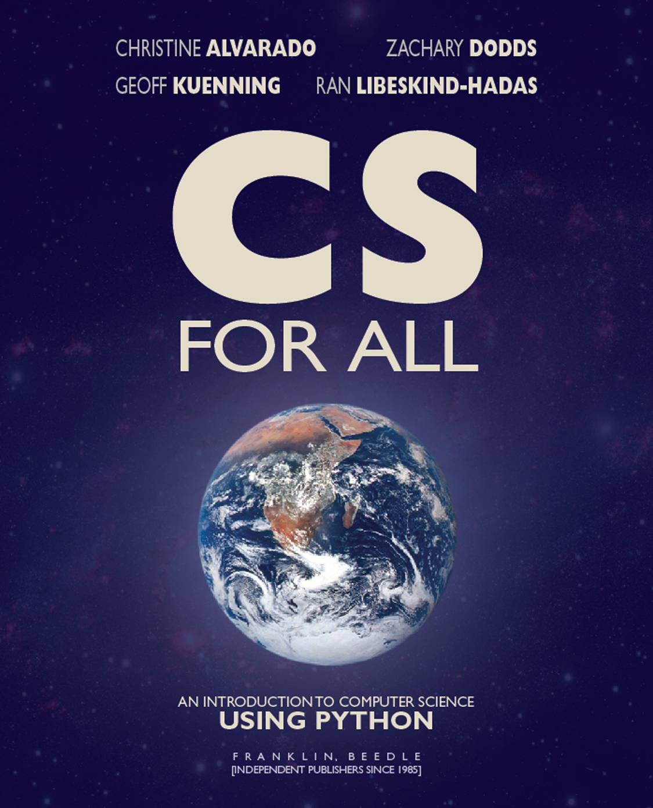
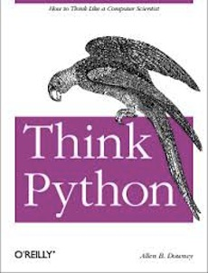

# CSCI 1100 Gateway to Computer Science

### Fall 2022

---

## Textbooks    

There are no required texts for this course but we do strongly recommend the [CS for All](https://redshelf.com/app/ecom/book/1189786/cs-for-all-1189786-9781590282915-christine-alvarado-zachary-dodds-geoffrey-kuenning-ran-libeskind-hadas) text. We will also post code and lecture notes. 

---

- [CS for All](https://redshelf.com/app/ecom/book/1189786/cs-for-all-1189786-9781590282915-christine-alvarado-zachary-dodds-geoffrey-kuenning-ran-libeskind-hadas), by Christine Alvarado, Zachary Dodds, Geoffrey Kuenning, Ran Libeskind-Hadas. (**Primary Recommendation**)

 

This $20 on-line book is used for the well-known CS1 course at Harvey Mudd College. The approach is very similar to ours and this book will be the primary textbook for our course. The organization of our course follows the outline of the book in broad outline but not in detail. You are responsible for keeping up with the reading in this text.

---

- [Think Python, How to Think Like a Computer Scientist](https://www.greenteapress.com/thinkpython/thinkpython.pdf), by Allen Downey. (**Secondary Recommendation**)

 
This free on-line book is a relatively easy introductory text for Python programming. This book is an ok substitute for CS for All if you don't want to part with $20. Think Python is good for reference or if you would like further discussion of a particular topic.

